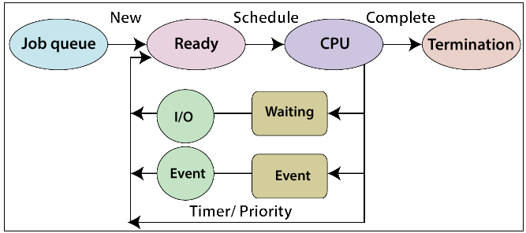

# 1.1 Basic Fundamentals

## Kernel

The term *kernel* means central software that manages and allocates computers resources.

* The Linux kernel executable typically resides at pathname boot/vmlinuz, or something similar.

### Task Performed By Kernel

Among other things, kernel performs following tasks:

* ***Process Scheduling*** : Nowadays almost every computer has more then one CPUs. Like other Unix systems, Linux is *preemptive multitasking* kernel, *Multitasking* means multiple process can simultaneously resides in memory and each may receive use of CPUs. *Preemptive* means that the rules governing which process receive use of CPU and how long are determined by kernel process scheduler rather then processes themselves.

* ***Memory Management*** : The kernel is responsible to share primary memory among processes in an equitable and efficient fashion. Like most other modern operating systems, Linux employs ***Virtual Memory Management***, a technique that confers two main advantages :

    * Processes are isolated from other processes and from kernel, so that one process can not read or write or modify memory of other processes and kernel.

    * Only part of process needs to be kept in RAM, thereby lowering the memory requirements of each process and allowing more processes to be held in RAM simultaneously. This leads to better CPU utilization since it increases the likelihood that, in any time, there is at least one process that the CPU(s) can execute.

* ***File Management*** : Kernel provides a file system on disk, allowing files to be created, deleted, retrieved and so on.

* ***Creation and Termination of Processes*** : The kernel can load a new program into memory, providing it with resources that it needs in order to run. Such instance of program in execution is termed a *process*. Once process has completed execution, the kernel ensures that resources it uses are freed for subsequent reuse by later programs.

* ***Access to Devices*** : Devices attached to a computer allow communication of information between the computer and the outside world, permitting input, output or both. Kernel provides programs with an interfaces that standardizes and simplifies access to devices, while same time arbitrating access by multiple process to each device.

* ***Networking*** : The kernel transmits and receives netwok messages (packets) on behalf of user processes. This task includes routing of network packets to target system.

* ***Provision of system call application programming interfaces (API)*** : Processes can request the kernel to perform various task using kernel entry points known as ***system calls***.

******************************************************************

### Kernel mode vs User mode

Modern processor architectures typically allow the **processor** to operate at least two different modes : *user mode* and *kernel mode*. ***Hardware instructions*** allow switching from one to another. Correspondingly, areas of virtual memory can be marked as being part of *user space* or *kernel space*.

## Shell

A shell is a special purpose program designed to read commands typed by user and execute appropriate programs in response to those commands. Such program is sometimes known as *command interpreter*.

### Shell 1

